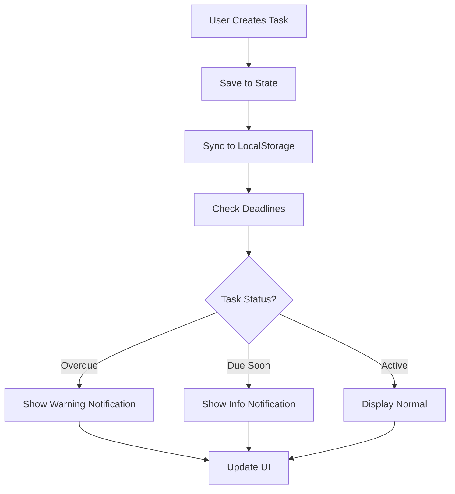

<div align="center">

# 🗓️ Task Scheduler Application

### *Your Smart, Modern To-Do Companion*

[](https://reactjs.org/)
[](https://developer.mozilla.org/en-US/docs/Web/JavaScript)
[](LICENSE)
[](CONTRIBUTING.md)

<p align="center">
  
  
  
</p>

*A modern, feature-rich Task Scheduler / To-Do application built with React that helps users manage tasks efficiently with deadlines, priorities, categories, search, filtering, and real-time notifications.*

[🚀 Demo](#) • [📖 Documentation](#) • [🐛 Report Bug](#) • [✨ Request Feature](#)

---

</div>

## ✨ Key Highlights

<table>
<tr>
<td>

🎯 **Smart Task Management**
- Intuitive task creation & editing
- Priority-based organization
- Category tagging system

</td>
<td>

⏰ **Intelligent Deadlines**
- Automatic overdue detection
- 24-hour advance warnings
- Visual status indicators

</td>
</tr>
<tr>
<td>

🔔 **Real-Time Notifications**
- Toast alerts for updates
- Persistent overdue reminders
- Success confirmations

</td>
<td>

💾 **Persistent Storage**
- Auto-save functionality
- LocalStorage integration
- Zero data loss

</td>
</tr>
</table>

---

## 🚀 Features

### 📝 Core Task Management

<details open>
<summary><b>Click to expand</b></summary>

- ✅ **Add new tasks** with comprehensive details:
  - 📄 Task description
  - 📅 Deadline (date & time picker)
  - 🎯 Priority levels (Low / Medium / High)
  - 🏷️ Category / Tag organization
  
- ✏️ **Edit existing tasks** seamlessly
- 🗑️ **Delete tasks** with confirmation
- ✓ **Mark tasks as completed** with visual feedback

</details>

### ⏰ Smart Deadline Handling

- 🤖 **Automatic detection** of:
  - ⚠️ Overdue tasks
  - ⏳ Tasks due within 24 hours
  
- 🎨 **Visual indicators**:
  - 🔴 **Overdue** - Red highlight
  - 🟡 **Due soon** - Yellow warning
  - 🟢 **Completed** - Green checkmark

### 🔔 Notification System (React Toastify)

| Event | Notification Type |
|-------|------------------|
| Task Added | ✅ Success |
| Task Updated | ✅ Success |
| Task Overdue | ⚠️ Warning |
| Task Deleted | ℹ️ Info |

### 📊 Task Statistics & Progress

```
📈 Dashboard Overview:
├── Total Tasks
├── Pending Tasks
├── Completed Tasks
└── Progress Bar (% Complete)
```

### 🔍 Advanced Filtering & Search

**View Filters:**
- 📋 All Tasks
- ⏳ Pending Tasks
- ✅ Completed Tasks

**Search Capabilities:**
- 🔎 Search by task description
- 🏷️ Search by category name

### 🎯 Smart Sorting

Tasks are intelligently sorted by:
1. **Priority** → High → Medium → Low
2. **Deadline** → Earliest first

---

## 🛠️ Tech Stack

<div align="center">

| Technology | Purpose | Badge |
|------------|---------|-------|
| **React** | Frontend Framework |  |
| **React Hooks** | State Management |  |
| **React Toastify** | Notifications |  |
| **LocalStorage API** | Data Persistence |  |
| **CSS3** | Styling |  |

</div>

---

## 📂 Project Structure

```
task-scheduler-app/
│
├── 📁 src/
│   ├── 📄 App.jsx          # Main application logic
│   ├── 🎨 App.css          # Component styling
│   ├── 📄 main.jsx         # React entry point
│   └── 📄 index.html       # HTML template
│
├── 📁 public/
├── 📄 package.json
├── 📄 vite.config.js
└── 📄 README.md
```

---

## ⚙️ Installation & Setup

### Prerequisites

- Node.js (v16+ recommended)
- npm or yarn

### 🚀 Quick Start

```bash
# 1️⃣ Clone the repository
git clone https://github.com/your-username/task-scheduler-app.git

# 2️⃣ Navigate to project directory
cd task-scheduler-app

# 3️⃣ Install dependencies
npm install

# 4️⃣ Start development server
npm run dev
```

The app will be available at **http://localhost:5173** 🎉

### 📦 Build for Production

```bash
npm run build
```

---

## 🎯 How It Works

<div align="center">



</div>

### 🔄 Core Flow

1. **Task Creation** → Stored in React state + LocalStorage
2. **Deadline Monitoring** → Runs every hour via `setInterval`
3. **Status Updates** → Dynamic UI rendering based on filters
4. **Notifications** → One-time alerts for overdue tasks
5. **Persistence** → Auto-save on every change

---

## 🔮 Future Enhancements

<div align="center">

| Feature | Status | Priority |
|---------|--------|----------|
| 🌙 Dark Mode | Planned | High |
| 🖱️ Drag & Drop | Planned | Medium |
| 📅 Calendar View | Planned | High |
| 🔐 Authentication | Planned | Medium |
| ☁️ Cloud Sync | Planned | Low |
| 📊 Export (CSV/PDF) | Planned | Medium |
| 📱 Mobile App | Future | Low |

</div>

---

## 🤝 Contributing

Contributions make the open-source community an amazing place! Any contributions you make are **greatly appreciated**.

### How to Contribute

1. 🍴 Fork the Project
2. 🔨 Create your Feature Branch (`git checkout -b feature/AmazingFeature`)
3. ✅ Commit your Changes (`git commit -m 'Add some AmazingFeature'`)
4. 📤 Push to the Branch (`git push origin feature/AmazingFeature`)
5. 🎉 Open a Pull Request

---

## 📄 License

Distributed under the **MIT License**. See `LICENSE` for more information.

---

## 👨‍💻 Author

<div align="center">

### **Vishal Bhingarde**

*React Developer | DSA Learner | Frontend Enthusiast*

[](https://linkedin.com/in/vishal-bhingarde-bb23a2376)
[](https://github.com/Vishal710-max)
[](https://your-portfolio.com)

</div>

---

## ⭐ Show Your Support

If you found this project helpful, please give it a ⭐️!

<div align="center">

**Made with ❤️ by Vishal Bhingarde**

[](https://github.com/Vishal710-max/task-scheduler-app)
[](https://github.com/Vishal710-max/task-scheduler-app/fork)

</div>

---

<div align="center">

### 🙏 Thank you for visiting!

*Built with passion and coffee ☕*

</div>
